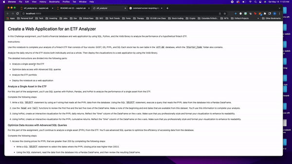

# Financial-Database

This is a Financial Database to analyze the performance of a fintech ETF. 

**This project was created using the following libaries and dependancies:**

* [python](https://www.python.org/) - programming language
* [pandas](https://pandas.pydata.org/)  - manipulation tool used for data analysis 
* [numpy](https://numpy.org/) - fundamental package for scientific computing with Python
* [hvplot](https://hvplot.holoviz.org/index.html) - high-level plotting API for the PyData ecosystem built on HoloViews
* [sqlalchemy](https://www.sqlalchemy.org/) - database toolkit
## Usage

Clone and run the application by running voila etf_analyzer.ipynb in terminal

## Example

## Contributors

Nadirah Durr
nadirahcodes@gmail.com

## License
MIT
